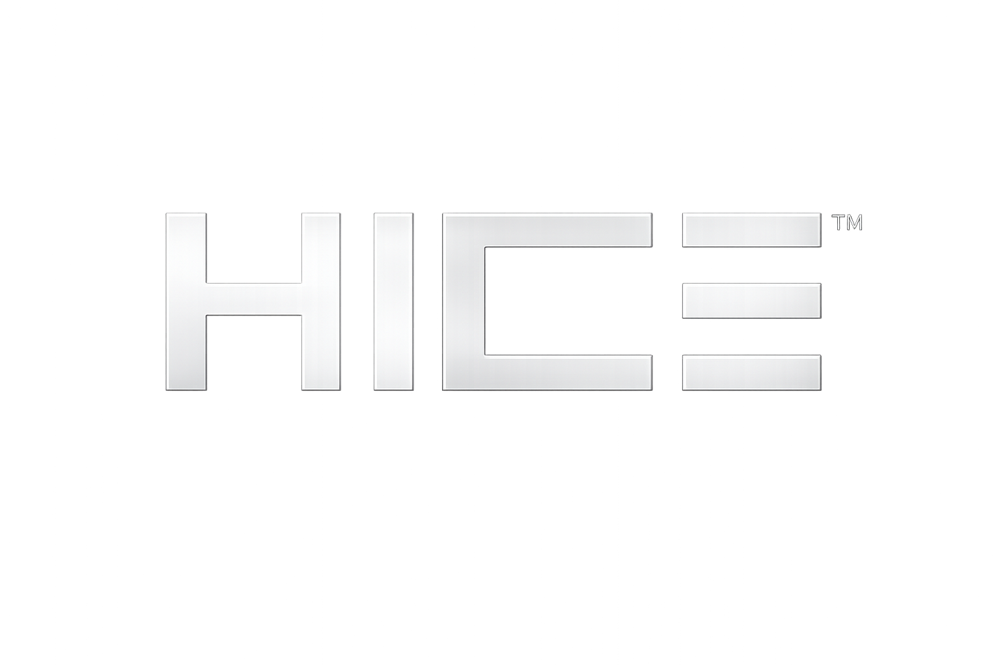
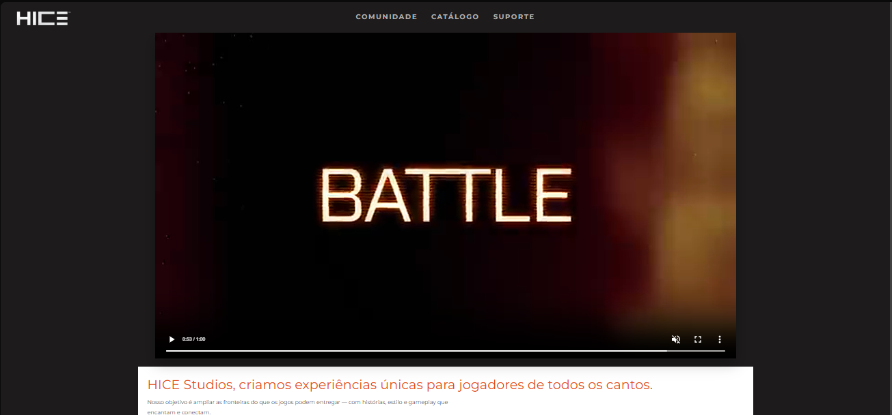
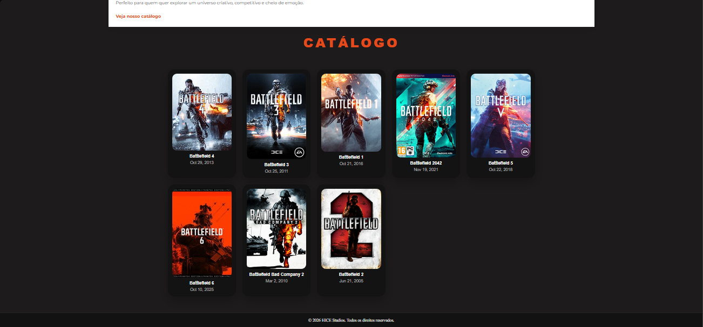
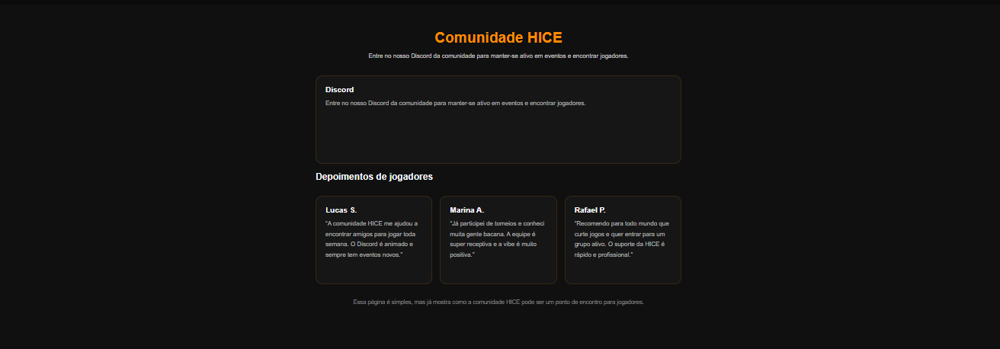
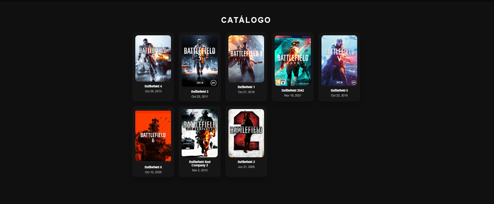
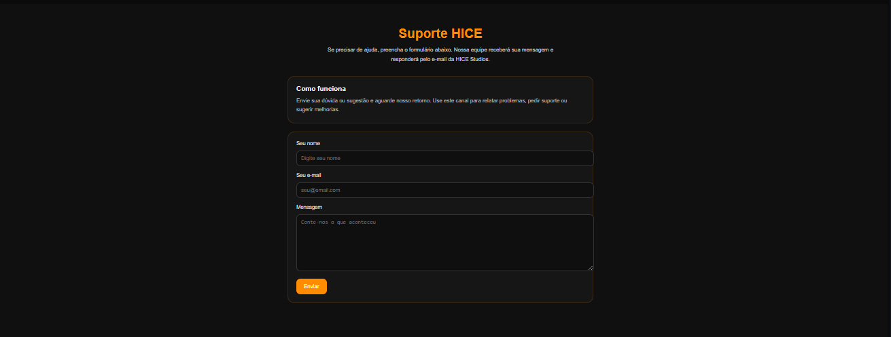

# HiceStudios — Landing Page

## Descrição do projeto

Landing page estática desenvolvida para apresentar o estúdio HiceStudios, seu catálogo de jogos e canais de suporte. O objetivo é oferecer uma página leve, responsiva e visualmente atraente para promover jogos, compartilhar comunidade e facilitar o contato com jogadores.

##  Logo ficticia do Studio

## Prints do site 

1. 
2. 
3. 
4. 
5. 

## Tecnologias utilizadas

- **HTML5** — estrutura semântica das páginas
- **CSS3** — estilos e responsividade (arquivos em `HiceStudios.com/assets/css/`)
- **JavaScript (opcional)** — interatividade e pequenos comportamentos 
- Ativos: imagens e vídeos otimizados (pasta `HiceStudios.com/assets/img/`)

## Inspiração e referências

- Sites de estúdios de jogos e landing pages modernas
- Inspirado no site da DICE studios: [https://www.dice.se](https://www.dice.se)
- Plataformas de design: Behance e Dribbble (ex.: layouts e paletas de cores)
- Referências visuais encontradas em sites reais de estúdios e lojas digitais
- Geração e ajustes de imagens via IA 

## Créditos da equipe

- Dev [Henrique de Lima Lima]

---

## Como visualizar localmente

1. Abra `HiceStudios.com/index.html` no navegador (duplo clique) ou sirva a pasta com um servidor estático.
2. Arquivos principais:
- `HiceStudios.com/index.html`
- `HiceStudios.com/catalog.html`
- `HiceStudios.com/assets/css/styles.css`

## Observações

Este repositório contém apenas a versão estática do site; para funcionalidades dinâmicas (login, backend, pagamentos) integrar serviços/servidores adicionais.
